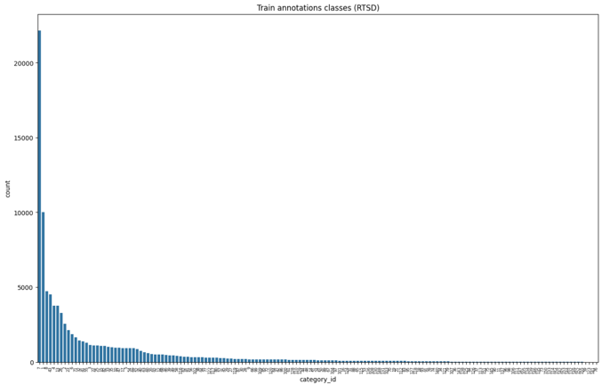

sign_detection_ml
==============================

Project to store shared code and notebooks with experiment

# How to setup

To run training you have to download data by one of the following ways:

## ClearML (recommended)
1) Run clearml init
```bash
clearml-init
```
2) Get ClearML credentials. Open the ClearML Web UI in a browser.
On the [SETTINGS > WORKSPACE](https://app.clear.ml/settings/workspace-configuration) page, click Create new credentials.

3) Enter the credentials in the terminal

After this data download will be done automatically

## Kaggle API 
Use the download and processing script from data/main.py. Run it with python and you will get data into data/raw folder (original raw version of data) and in 
the data/processed folder (processed version of data with train/test split and filtered labels)
```bash
python sign_recognition/data/main.py
```
*Note: You have to provide kaggle api credentials*
*Note1: You can change the config via providing environment variables (see sign_recognition/envs.py for details)*

# How to run

1) Run train.py script
```bash
python sign_recognition/train.py
```
*Note: You can change the config via command line arguments or by changing .yaml config in configs directory (https://hydra.cc/docs/tutorials/basic/your_first_app/simple_cli/)*

Project Organization
------------

    ├── Makefile           <- Makefile with commands like `make lint` or `make clean` - dev utils commands
    ├── README.md          <- The top-level README for developers using this project.
    ├── data
    │   ├── external       <- Data from third party sources.
    │   ├── interim        <- Intermediate data that has been transformed.
    │   ├── processed      <- The final, canonical data sets for modeling.
    │   └── raw            <- The original, immutable data dump.
    │
    ├── docs               <- Documentation for project in markdown format
    │
    ├── models             <- Trained and serialized models, model predictions, or model summaries
    │
    ├── notebooks          <- Jupyter notebooks. Naming convention is a number (for ordering),
    │                         the creator's initials, and a short `-` delimited description, e.g.
    │                         `1.0-jqp-initial-data-exploration`.
    │
    ├── pyproject.toml     <- The requirements and config file for reproducing the analysis environment and have config for project
    │
    ├── sign_recognition   <- Source code for use in this project.
    │   ├── __init__.py    <- Makes src a Python module
    │   │
    │   ├── data           <- Scripts to download, generate data, process it. Upload it to ClearML with new version
    │   │
    │   ├── features       <- Scripts to turn raw data into features for modeling (Dataloaders, Datamodules, pytorch Dataset). Download data from ClearML
    │   │
    │   ├── models         <- Scripts to train models and define them
    │   │
    │   ├── envs.py        <- Environment variables for project
    │   │
    │   └── train.py       <- Main script to train models
    │
    └── .pre-commit-config.yaml  <- pre-commit config file to run hooks on commit (run pre-commmit init to use)

## Отчёт по проекту

Все основные предпоссылки, архитектура, выбор метрик, издержки и тд описаны в ML system design документы, который находится по пути:
docs/design_doc.md

## Описание работы

### Предпобработка данных

В качестве датасета был выбран RTSD (Russian Traffic Sign Detection) - версия с kaggle, все скрипты его обработки находятся в папке sign_recognition/data
Основные возникшие проблемы, это проблемы с классами. Некоторые из классов отсутствуют в датасете, некоторые классы имеют очень мало примеров, некоторые классы не матчатся с тестовой выборкой
(либо класса из трейна нет в тестовой выборке, либо класса из теста нет в трейне). Эти проблемы было решено решить следующим образом:
Удалить классы, которые имеют меньше 1% от общего количества примеров в датасете.

Диаграмму распределения классов можно увидеть ниже:


После удаления классов, которые имеют меньше 1% от общего количества примеров в датасете. Датасет был переведён в формат YOLOv5 для 
возможности обучения модели. Для этого была использована библиотека FiftyOne

### Модель

В качестве моделей для сравнения были выбраны следующие модели:
1) YOLOv8n
2) FasterRCNN_MobileNet_V3

Для обучения моделей был использован Pytorch Lightning. Для конфигурации гиперпараметров и проекта была использована hydra-core.

### Результаты

| model                                               | mAP-50  | Precision | Recall | mAP-50-95 | Time (ms)          | 
|-----------------------------------------------------|---------|-----------|--------|-----------|--------------------|
| YOLO v8                                             | 0.95    | 0.908     | 0.898  | 0.7       | 30.64(torchscript) | 
| Faster RCNN MobileNet V3 (without data preparation) | -       | 0.24      | 0.165  | -         | 60.36              |

YOLO эксперимент: https://app.clear.ml/projects/0bae41b5f79a4361930cddb611648e9b/experiments/54c742ed3071423e9ffdf167c328b6e3/output/execution
Faster RCNN MobileNet V3 без предобработки данных: https://app.clear.ml/projects/0bae41b5f79a4361930cddb611648e9b/experiments/6f8c28b6077f435cbf6ea8d39440ff22/output/execution

