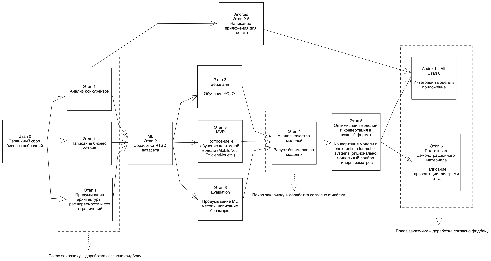
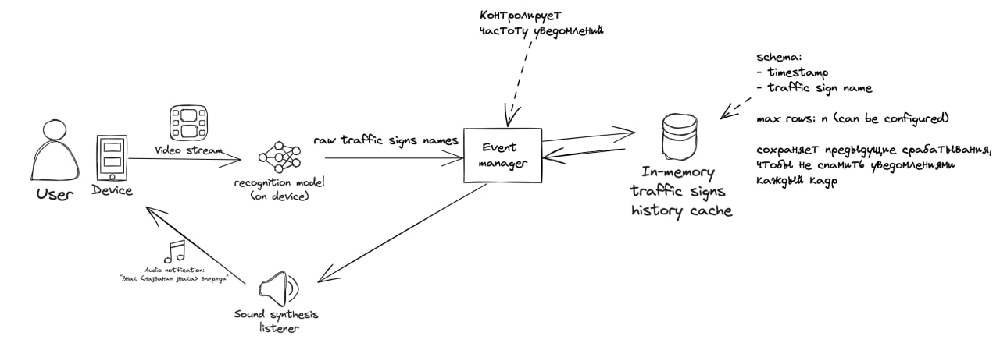

# ML System Design Doc
## Дизайн ML системы - Astute Sign Detection MVP

> ## Термины и пояснения
> - Итерация - это все работы, которые совершаются до старта очередного пилота  
> - БТ - бизнес-требования 
> - EDA - Exploratory Data Analysis - исследовательский анализ данных  
> - `Product Owner`,  `Data Scientist` - роли, которые заполняют соответствующие разделы 
> - В этом шаблоне роль `Data Scientist` совмещает в себе компетенции классического `Data Scientist` с упором на исследования и `ML Engineer` & `ML Ops` роли с акцентом на продуктивизацию моделей

### 1. Цели и предпосылки 
#### 1.1. Зачем идем в разработку продукта?  

- **Бизнес-цель** в сокращении количества штрафов на дорогах для клиентов, использующих эту систему
- ML сократит количество штрафов благодаря сокращению человеческого фактора - ML система не устаёт и способна видеть даже
самые мелкие детали
- Успех продукта невозможно вычислить напрямую, поэтому возможно использовать только прокси метрики - количество пропущенных и верно классифицированных знаков системой

Успех:
- **Количество верно распознанных знаков** = 0.7 * n, где n - это количество всех знаков в 
проверочной выборке.

#### 1.2. Бизнес-требования и ограничения  

- Логика работы системы: мобильное приложение, которое вешается на стекло автомобиля a.k.a видеорегистратор и посылает 
звуковые уведомления о знаках на дороге водителю
**- Бизнес ограничения** 
1) Приложение должно посылать уведомление о предстоящем знаке с задержкой достаточной для реагирования водителем - 10 секунд до пересечения знака водителем. В идеале даже раньше
2) Приложение должно работать без использования интернета и полностью на устройстве пользователя 
3) Приложение не должно запрашивать дополнительных данных (например гео локацию для определения ближайших знаков по базам навигаторов)
4) Знаки с дополнительными данными (ограничение высоты, ограничение скорости движения и тд) должны быть распознаны и произнесены приложением

- Оценка пилота будет производиться по видео с этого канала https://www.youtube.com/@dashcamdriverelaxingdrivev7021. 
Необходима возможность загрузки уже записанных видео для демо
- Успешный пилот - приложение с минимальным интерфейсом и демонстрируемым видеопотоком с 
1) Голосовом оповещении о приближающемся знаке, если знак содержит дополнительную информацию, она должна озвучиваться
2) Указанием при помощи bbox-a на знак в видеопотоке
3) Загрузка и просмотр распознавания видео в реальном времени

Возможные доработки:
1) Отображение расстояние до знака
#### 1.3. Что входит в скоуп проекта/итерации, что не входит   

- В скоуп итерации не входит распознавание навигационных знаков
- Результат с точки зрения качества кода и воспроизводимости решения: 
1) ML модель развёрнутая, либо несколько ML моделей, способные запускаться на Android или IOS (предположительно в onnx формате)
2) Android приложение
3) Репозиторий с ноутбуками и экспериментами.
4) Логи экспериментов для понимания качества моделей заказчиком.

Описание планируемого технического долга:
1) Обновление моделей на мобильных устройствах
2) Мониторинг метрик системы в production среде 
3) Адаптацию под другие знаки

### 2. Методология

#### 2.1. Постановка задачи  
Real time traffic sign recognition

#### 2.2. Блок-схема решения  

- Блок схема для MVP:

#### 2.3. Этапы решения задачи

> Примеры этапов:  
> - Этап 2 - Обработка датасета с русскими дорожными знаками 
> - Этап 3.1 - Обучение YOLO (бейзлайн)
> - Этап 3.2 - Обучение кастомной модели
> - Этап 3.3 - Написание бэнчмарка для сравнения моделей
> - Этап 4 - Запуск бэнчмарка для моделей
> - Этап 5 - Конвертация модели в нужный формат
> - Этап 6 - Создание инференса для модели (интеграция в demo android приложение)

*Этап 2 - подготовка данных*  

Результатом работы данного этапа должны быть данные и признаки для обучения модели.
Признаки: 

| Название данных                  | Ссылка                                                                      | Требуемый ресурс для получения данных (какие роли нужны) | Проверено ли качество данных (да, нет) |
|----------------------------------|-----------------------------------------------------------------------------| ------------- |----------------------------------------|
| Russian traffic sign recognition | [ссылка](https://graphics.cs.msu.ru/projects/traffic-sign-recognition.html) | DE/DS | -                                      |

Все данные представлены в виде изображений с дорог. Открытые вопросы:
- Достаточно ли разнообразные данные для обучения модели (есть ли в данных все возможные знаки, есть ли разные погодные условия, разные типы дорог и тд)
- Достаточно ли данных для обучения модели (возможно ли обучить модель на этих данных)
- Какие дополнительные данные необходимы для обучения модели (возможно ли их получить, какие роли нужны для получения данных)
- Есть ли знаки с различными дополнительными данными (скорость, высота, вес и тд)

Целевая переменная для каждого знака на каждом изображении:
- Класс знака
- bbox в формате (x,y,w,h)
- Дополнительные данные (скорость, высота, вес и тд)

На выходе должны быть готовые dataloader-ы для каждого датасета, написанные на pytorch.  

*Этап 3.1 Обучение YOLO*
Предполагается использование YOLOv8. Обучение модели будет проводиться либо на локальном железе, 
либо с использованием облачных технологий наподобие Google Colab.
Возможные риски:
- Необходимость переработать данные для обучения модели (например, необходимо разбить изображения на более мелкие части)
- Возможно нехватание ресурсов для инференса модели в продакшен среде - **ВАЖНО проверить время работы модели на CPU**
- train/inference дрифт на мобильном устройстве возможно гораздо худшее качество

Что нужно сделать:
- Продумать loss функцию для обучения модели
- Обучить модель

Результат работы:
- Веса модели YOLO

*Этап 3.2 Обучение кастомной модели*
Риски те же, что и в предыдущем пункте

Что нужно сделать:
- Выбрать модель для проверки гипотезы
- Продумать loss функцию для обучения модели
- Обучить модель

*Этап 3.3 Написание бэнчмарка*
Предполагается написать скрипт для бэнчмарка моделей. Скрипт должен принимать на вход модель и датасет, 
выдавать на выходе метрики качества модели. Метрики качества должны быть выбраны таким образом, 
чтобы быть согласованными с бизнес-целями.

Что нужно сделать:
- Написать бэнчмарк для сравнения моделей
- Разметить пару видео для проверки качества всего пайплайн

*Этап 4 Запуск бэнчмарка для моделей*

Запустить эксперименты и сравнить качество моделей, выбрать лучшую

*Этап 5 Конвертация модели в нужный формат*
Конвертировать и дооптимизировать лучшую модуль в формат, подходящий для инференса

*Этап 6 Создание инференса для модели*

Помочь android разработчику интегрировать модель в демо-приложение.

### 3. Подготовка пилота  
  
#### 3.1. Способ оценки пилота  
  
Критерии из notion
  
#### 3.2. Что считаем успешным пилотом  
  
Критерии из notion
  
#### 3.3. Подготовка пилота  
  
Можем позволить android приложение с загрузкой видео и выводом результатов на экран.

#### 4. Архитектура решения   
  

#### 4.1. Описание инфраструктуры и масштабируемости 
  
- Выбрана инфраструктура edge computing
- Это связано с бизнес-требованиями отсутствия интернета
- Плюсы:
1) Всё работает без интернета
2) Не нужно платить за облачные вычисления
3) Не нужно платить за трафик
4) Не нужно платить за облачное хранилище
5) Не нужно платить за облачную базу данных
6) Всё работает быстро
7) Обеспечивается высокая конфиденциальность данных
Минусы:
1) Мы теряем в масштабируемости
2) Мы теряем в удобстве разработки
3) Мы теряем в удобстве обновления моделей
4) Мы теряем в удобстве обновления приложения
5) Мы теряем в удобстве сбора метрик
6) Мы теряем в удобстве мониторинга
7) Мы теряем в удобстве отладки
8) Мы теряем в качестве моделей из-за необходимости оптимизации
  
#### 4.3. Требования к работе системы  

TBD Будет сделано по итогу обучения моделей. 

Сейчас можем сказать, что необходимо обеспечить хотя бы 3 кадра в секунду на среднем устройств
- SLA, пропускная способность и задержка `Data Scientist`  

#### 4.4. Безопасность системы  
  
Потенциальных уязвимостей не обнаружена.

#### 4.5. Безопасность данных   
  
- Так как интернет отсутствует, то данные не будут передаваться по сети и никуда не будут сохраняться.
  
#### 4.6. Издержки  
  
- Издержек нет, так как она работает на устройстве пользователя.
- 
#### 4.5. Integration points  

Указаны на диаграмме
#### 4.6. Риски  
  
Возможные риски пока не известны   

